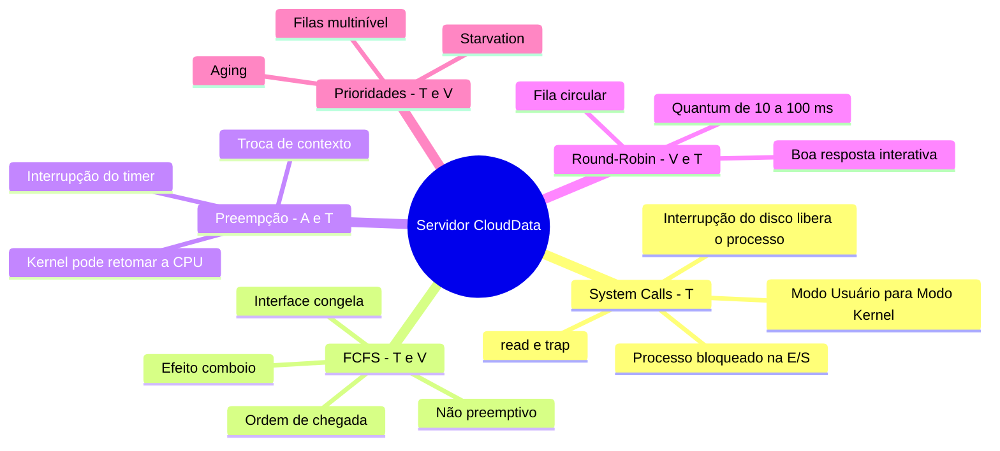

### Diário de Bordo — Encontro 6
#### O Dilema do Servidor em Nuvem: chamadas de sistema e escalonamento de processos

**Aluna:** Yasmin Fernanda de Carvalho<br>
**Disciplina:** Sistemas Operacionais<br>
**Data:** 01/10/2026

### 1. Contexto do problema

A CloudData mantém sua aplicação em um servidor com **um único núcleo de processamento**. Esse núcleo é disputado por dois tipos de carga:

- **Processos interativos:** requisições curtas vindas da interface web, que dependem de resposta quase imediata.
- **Processos batch:** relatórios financeiros que processam grandes volumes de dados lidos do disco.

O servidor usa o escalonamento **FCFS (First-Come, First-Served)**, e a consequência percebida pelos usuários é o congelamento frequente da interface. Para entender a origem desse comportamento, é preciso observar dois mecanismos do sistema operacional:

1. A forma como os processos pedem serviços ao kernel, por meio das chamadas de sistema.
2. A forma como o escalonador decide quem usa a CPU.

### 2. A barreira entre o programa e o hardware

Os processos de usuário não têm acesso direto aos dispositivos. Essa restrição é garantida pelo próprio processador, que possui um **bit de modo** para separar dois níveis de privilégio (SILBERSCHATZ; GALVIN; GAGNE, 2015):

- No **modo usuário**, apenas instruções comuns podem ser executadas.
- No **modo kernel**, o sistema operacional tem controle total sobre memória e dispositivos.

Sempre que um programa precisa de algo que só o SO pode fazer, ele usa uma **chamada de sistema (system call)**. A leitura dos dados financeiros pelo relatório segue este caminho:

1. O programa chama uma função da biblioteca padrão, como `read()`.
2. Essa função coloca nos registradores o número da chamada de sistema e seus parâmetros.
3. A função executa uma instrução de **trap** (no x86-64, a instrução `syscall`), que muda a CPU para o modo kernel e desvia a execução para o núcleo (TANENBAUM; BOS, 2016; LINUX MAN-PAGES PROJECT, 2024b).
4. O kernel valida o pedido, confere as permissões e aciona o driver do disco.

Como o disco é muito mais lento que a CPU, o kernel não mantém o processo ocupando o processador enquanto espera:

1. O processo de relatório passa do estado **executando** para **bloqueado**, e o escalonador entrega a CPU a outro processo.
2. Quando a leitura termina, o controlador do disco gera uma **interrupção**. O kernel disponibiliza os dados e o processo passa para o estado **pronto**.
3. Quando volta a ser escolhido, a CPU retorna ao **modo usuário** e a execução continua logo após a chamada `read()` (TANENBAUM; BOS, 2016).

| Momento | Modo da CPU | Estado do processo |
|---|---|---|
| Processando os dados do relatório | Usuário | Executando |
| Chamada `read()` (trap) | Kernel | Executando (dentro do kernel) |
| Espera pelo disco | — (CPU com outro processo) | Bloqueado |
| Interrupção do disco, dados disponíveis | Kernel | Pronto |
| Novo escalonamento | Usuário | Executando |

Esse ciclo mostra que o escalonador é acionado com frequência: a cada bloqueio, término ou interrupção, o SO decide qual processo vai usar a CPU em seguida. O critério dessa decisão é o que define se o sistema vai parecer ágil ou travado.

### 3. Diagnóstico: o FCFS no servidor da CloudData

O FCFS atende os processos na **ordem de chegada** à fila de prontos. O processo escolhido usa a CPU até terminar ou até se bloquear por conta própria (SILBERSCHATZ; GALVIN; GAGNE, 2015). O algoritmo é simples e justo no sentido da ordem, mas é **não preemptivo**: o sistema operacional não tem o poder de retirar a CPU de um processo que está executando, mesmo que haja trabalho mais urgente esperando (TANENBAUM; BOS, 2016).

No servidor da CloudData, essa característica produz o **efeito comboio (convoy effect)**. O relatório alterna longos trechos de cálculo com leituras de disco. Durante cada trecho de cálculo, ele ocupa o único núcleo sem interrupção, e as requisições web, que precisariam de poucos milissegundos, ficam enfileiradas atrás dele.

Um exemplo numérico mostra o tamanho do problema. Se um trecho do relatório exige 8 s de CPU e uma requisição de 20 ms chega logo depois:
- A requisição espera cerca de **8 s** para ser atendida.
- O tempo de espera é **400 vezes** maior que o tempo de que ela realmente precisa.

Para o usuário, isso aparece como a interface congelada. Como só existe um núcleo, não há outro processador que possa atender a interface enquanto isso. A responsividade do sistema inteiro passa a depender do processo mais lento da fila. Por isso, Tanenbaum e Bos (2016) consideram algoritmos não preemptivos aceitáveis em sistemas puramente batch, mas inadequados para sistemas interativos.

Vale registrar como isso se reflete em um servidor real. No Linux, o administrador não escolhe um algoritmo para a máquina inteira, mas uma **política de escalonamento por processo** (LINUX MAN-PAGES PROJECT, 2024a):
- `SCHED_OTHER` é a política padrão de tempo compartilhado.
- `SCHED_FIFO` corresponde a um FCFS dentro de um mesmo nível de prioridade.
- `SCHED_RR` é a variante com fatia de tempo, ou seja, Round-Robin.

A política é definida pela chamada de sistema `sched_setscheduler()` ou pelo comando `chrt`:

```bash
# executa o relatório com política FIFO (comportamento semelhante ao FCFS)
sudo chrt -f 10 ./gerar_relatorio

# muda um processo em execução para Round-Robin
sudo chrt -r -p 10 <PID>

# reduz a prioridade de um processo comum (nice maior = menor prioridade)
renice +10 -p <PID>
```

O cenário da CloudData equivale, portanto, a manter todos os processos em `SCHED_FIFO` com a mesma prioridade.

### 4. Proposta de solução: Round-Robin

A solução mais adequada para a responsividade da interface é o **Round-Robin (RR)**. Ele mantém os processos prontos em uma **fila circular** e concede a cada um a CPU por, no máximo, um intervalo fixo chamado **quantum**, normalmente entre 10 e 100 ms (TANENBAUM; BOS, 2016; SILBERSCHATZ; GALVIN; GAGNE, 2015).

O funcionamento é o seguinte:
- Quando o quantum termina, o temporizador gera uma interrupção. O kernel faz a **preempção**: salva o contexto do processo atual, o coloca no fim da fila e entrega a CPU ao próximo.
- Se o processo se bloquear ou terminar antes do fim do quantum, a troca acontece imediatamente.

Aplicado à CloudData, o relatório deixa de monopolizar o núcleo. Com quantum de 20 ms, uma requisição web espera no máximo alguns quanta, e não segundos. Como ela precisa de pouco processamento, geralmente termina dentro do primeiro quantum que recebe. De forma geral, com *n* processos na fila e quantum *q*, nenhum processo espera mais que **(n − 1) × q** pela próxima vez na CPU (SILBERSCHATZ; GALVIN; GAGNE, 2015). O relatório continua avançando, apenas de forma intercalada.

A eficácia do RR depende da escolha do quantum:
- **Quantum grande demais** faz o algoritmo se comportar como o FCFS e o congelamento volta.
- **Quantum pequeno demais** faz a CPU gastar muito tempo com trocas de contexto em vez de trabalho útil.

As alternativas baseadas em duração do processo são menos adequadas:
- O **SJF (Shortest Job First)** favorece processos curtos, mas é não preemptivo. Uma requisição que chega durante o relatório ainda teria de esperar. Além disso, ele exige conhecer antecipadamente a duração de cada tarefa, o que não é realista em um servidor web.
- O **SRTN (Shortest Remaining Time Next)** é a versão preemptiva do SJF e resolve a espera, mas mantém a dependência de estimativas de tempo. Ele também pode adiar indefinidamente o relatório quando chegam requisições curtas sem parar (TANENBAUM; BOS, 2016).

O Round-Robin não depende de previsão e garante progresso a todos os processos, o que o torna a escolha mais segura para cargas interativas.

### 5. Prioridades, starvation e aging

Uma alternativa seria usar **escalonamento por prioridades**, com a interface web sempre na prioridade máxima. Isso melhoraria a resposta da interface, mas cria outro risco. Em um servidor com fluxo contínuo de requisições, sempre haveria um processo web pronto, e os relatórios batch poderiam **nunca** receber a CPU. Esse fenômeno é a **starvation (inanição)**: um processo pronto espera indefinidamente porque há sempre outro de maior prioridade à sua frente (SILBERSCHATZ; GALVIN; GAGNE, 2015).

O mecanismo clássico para evitar a starvation é o **envelhecimento (aging)**. O sistema operacional eleva gradualmente a prioridade dos processos que estão esperando há muito tempo. Assim, mesmo o relatório de menor prioridade acaba alcançando um nível que lhe garante execução (SILBERSCHATZ; GALVIN; GAGNE, 2015).

Uma organização ainda mais completa são as **filas multinível com realimentação**:
- Os processos interativos ficam em uma fila de alta prioridade atendida por Round-Robin.
- Os processos batch ficam em filas de menor prioridade.
- Processos que esperam demais podem ser promovidos de fila.

Esse esquema combina responsividade para a interface com garantia de progresso para os relatórios (TANENBAUM; BOS, 2016).

### 6. Conclusão

O congelamento da interface da CloudData não é falha de hardware, mas consequência da política de escalonamento. O FCFS, por ser não preemptivo, permite que os trechos longos de processamento dos relatórios bloqueiem o único núcleo e produzam o efeito comboio sobre as requisições web.

A preempção por tempo do Round-Robin, apoiada nas interrupções e na passagem para o modo kernel, que é o mesmo mecanismo usado pelas chamadas de sistema, devolve a responsividade ao sistema. Caso se adote um esquema de prioridades, o uso de aging ou de filas multinível com realimentação é essencial para que os relatórios não sofram starvation.

### 7. Instrumento visual de síntese

O mapa mental conecta os conceitos com as fontes multimídia consultadas:
- **T** = texto
- **V** = vídeo
- **A** = áudio



> Conexão entre as fontes: o podcast (A) discute os modelos de preempção do kernel Linux, isto é, em que momentos o kernel pode tomar a CPU de uma tarefa. Esse é o mecanismo ausente no FCFS e presente no Round-Robin apresentado no vídeo (V). A preempção, por sua vez, depende de interrupções e da entrada no modo kernel, o mesmo caminho percorrido pelas system calls descritas nos textos (T).

### Referências

LINUX MAN-PAGES PROJECT. **sched(7)**: overview of CPU scheduling. [*S. l.*]: man7.org, 2024a. Disponível em: https://man7.org/linux/man-pages/man7/sched.7.html. Acesso em: 1 out. 2026.

LINUX MAN-PAGES PROJECT. **syscalls(2)**: Linux system calls. [*S. l.*]: man7.org, 2024b. Disponível em: https://man7.org/linux/man-pages/man2/syscalls.2.html. Acesso em: 1 out. 2026.

LINUX UNPLUGGED. **593**: Zen and the Art of Kernel Preempting. [*S. l.*]: Jupiter Broadcasting, 15 dez. 2024. Podcast. Disponível em: https://linuxunplugged.com/593. Acesso em: 1 out. 2026.

SILBERSCHATZ, Abraham; GALVIN, Peter Baer; GAGNE, Greg. **Fundamentos de sistemas operacionais**. 9. ed. Rio de Janeiro: LTC, 2015.

TANENBAUM, Andrew S.; BOS, Herbert. **Sistemas operacionais modernos**. 4. ed. São Paulo: Pearson Education do Brasil, 2016.

UNIVESP. **Sistemas Operacionais – Aula 06 – Escalonamento de Processo**. [*S. l.*: *s. n.*], [2017]. 1 vídeo (25 min). Publicado pelo canal UNIVESP. Disponível em: https://www.youtube.com/watch?v=MWbPgxOCrFk. Acesso em: 1 out. 2026.
