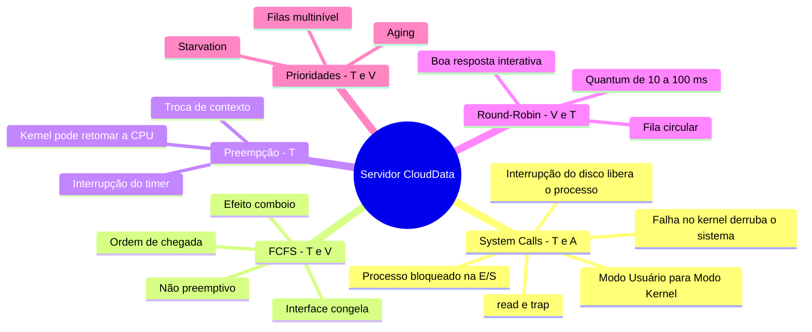

# Diário de Bordo — Encontro 6
#### O Dilema do Servidor em Nuvem: chamadas de sistema e escalonamento de processos

 

**Aluna:** Yasmin Fernanda de Carvalho 
**Disciplina:** Sistemas Operacionais 
**Data:** 01/10/2026

 

### 1. Contexto do problema

A CloudData mantém sua aplicação em um servidor com **um único núcleo**, disputado por dois tipos de carga:

- **Processos interativos:** requisições curtas da interface web, que precisam de resposta imediata.
- **Processos batch:** relatórios financeiros pesados, com muita leitura em disco.

O servidor usa o escalonamento **FCFS (First-Come, First-Served)**, e a interface web "congela" com frequência. Para entender o motivo, é preciso observar como os processos pedem serviços ao kernel e como o escalonador decide quem usa a CPU.

 

### 2. A barreira entre o programa e o hardware

Os processos de usuário não acessam o hardware diretamente. O processador tem um **bit de modo** que separa dois níveis de privilégio (SILBERSCHATZ; GALVIN; GAGNE, 2015):

- **Modo usuário:** só executa instruções comuns.
- **Modo kernel:** tem controle total sobre memória e dispositivos.

Para ler os dados do disco, o processo de relatório faz uma **chamada de sistema (system call)**:

1. O programa chama uma função da biblioteca, como `read()`.
2. Essa função executa uma instrução de **trap**, que muda a CPU para o modo kernel e passa o controle ao sistema operacional (MAZIERO, 2019; TANENBAUM; BOS, 2016).
3. O kernel valida o pedido e aciona o driver do disco.

Como o disco é lento, o processo não fica ocupando a CPU enquanto espera:

1. O processo passa de **executando** para **bloqueado**, e a CPU vai para outro processo.
2. Quando a leitura termina, o disco gera uma **interrupção** e o processo passa para **pronto**.
3. Ao ser escolhido de novo, ele volta ao **modo usuário** e continua de onde parou (TANENBAUM; BOS, 2016).

| Momento | Modo da CPU | Estado do processo |
|---|---|---|
| Processando dados | Usuário | Executando |
| Chamada `read()` | Kernel | Executando (no kernel) |
| Espera pelo disco | — | Bloqueado |
| Interrupção do disco | Kernel | Pronto |
| Novo escalonamento | Usuário | Executando |

 

### 3. Diagnóstico: o FCFS no servidor

O FCFS atende os processos na **ordem de chegada**, e cada um usa a CPU até terminar ou se bloquear (SILBERSCHATZ; GALVIN; GAGNE, 2015). Ele é **não preemptivo**: o sistema operacional não pode tirar a CPU de um processo em execução, mesmo que haja trabalho urgente esperando (TANENBAUM; BOS, 2016).

Na CloudData, isso gera o **efeito comboio (convoy effect)**. Durante os trechos de cálculo do relatório, ele ocupa o único núcleo, e as requisições web, que precisariam de poucos milissegundos, ficam presas na fila atrás dele. Se um trecho do relatório exige 8 s de CPU, uma requisição de 20 ms que chegue logo depois espera cerca de 8 s, e o usuário vê a interface congelada. Por isso, algoritmos não preemptivos são inadequados para sistemas interativos (TANENBAUM; BOS, 2016).

Em um servidor Linux real, a política de escalonamento é definida por processo (MAZIERO, 2019):
- `SCHED_FIFO` funciona como um FCFS dentro do mesmo nível de prioridade.
- `SCHED_RR` é a versão Round-Robin.

Ela pode ser alterada com o comando `chrt`. Por exemplo, `chrt -r -p 10 <PID>` muda um processo para Round-Robin.

 

### 4. Proposta de solução: Round-Robin

A solução mais adequada é o **Round-Robin (RR)**. Os processos prontos ficam em uma **fila circular** e cada um usa a CPU por, no máximo, um intervalo fixo chamado **quantum**, normalmente entre 10 e 100 ms. Quando o quantum acaba, o temporizador gera uma interrupção e o kernel faz a **preempção**: salva o contexto do processo, o coloca no fim da fila e passa a CPU ao próximo (TANENBAUM; BOS, 2016).

Assim, o relatório deixa de monopolizar o núcleo. Com quantum de 20 ms, uma requisição web espera no máximo alguns quanta, e não segundos, e o relatório continua avançando de forma intercalada. O quantum precisa ser equilibrado:
- **Grande demais:** o RR se comporta como o FCFS.
- **Pequeno demais:** a CPU perde tempo com trocas de contexto (SILBERSCHATZ; GALVIN; GAGNE, 2015).

Os outros algoritmos são menos adequados:
- O **SJF** é não preemptivo, então a requisição ainda esperaria o relatório.
- O **SRTN** resolve a espera, mas, assim como o SJF, exige estimar a duração de cada processo, o que não é realista em um servidor web.

 

### 5. Prioridades, starvation e aging

Se a interface web tivesse sempre prioridade máxima, os relatórios poderiam **nunca** executar enquanto chegassem requisições. Esse problema é a **starvation (inanição)**: um processo pronto espera indefinidamente porque sempre há outro mais prioritário à frente.

A solução é o **envelhecimento (aging)**: o sistema operacional aumenta aos poucos a prioridade dos processos que esperam há muito tempo, até que eles consigam executar (SILBERSCHATZ; GALVIN; GAGNE, 2015).

 

### 6. Conclusão

O congelamento da interface é causado pela política de escalonamento, e não pelo hardware. O FCFS, por ser não preemptivo, deixa os relatórios bloquearem o único núcleo. O Round-Robin resolve isso com preempção por tempo. Se forem usadas prioridades, o aging garante que os relatórios não sofram starvation.

 

### 7. Instrumento visual de síntese

O mapa mental conecta os conceitos com as fontes consultadas:
- **T** = texto
- **V** = vídeo
- **A** = áudio

> Conexão entre as fontes: o podcast (A) discute o incidente da CrowdStrike de 2024, em que um componente que executava no kernel do Windows travou milhões de computadores. Isso mostra por que o modo kernel é protegido e por que os programas usam chamadas de sistema (T). A entrada no modo kernel pela interrupção do temporizador é também o que permite a preempção do Round-Robin, apresentado no vídeo (V).

 

### Referências

HIPSTERS PONTO TECH. **Incidente Incrível da CloudStrike**: Hipsters Ponto Tech #421. [*S. l.*]: Alura, 23 jul. 2024. Podcast (53 min). Disponível em: https://www.alura.com.br/podcast/incidente-incrivel-da-cloudstrike-hipsters-ponto-tech-421-a9376. Acesso em: 1 out. 2026.

MAZIERO, Carlos Alberto. **Sistemas operacionais**: conceitos e mecanismos. Curitiba: Editora da UFPR, 2019. Disponível em: http://wiki.inf.ufpr.br/maziero/doku.php?id=socm:start. Acesso em: 1 out. 2026.

SILBERSCHATZ, Abraham; GALVIN, Peter Baer; GAGNE, Greg. **Fundamentos de sistemas operacionais**. 9. ed. Rio de Janeiro: LTC, 2015.

TANENBAUM, Andrew S.; BOS, Herbert. **Sistemas operacionais modernos**. 4. ed. São Paulo: Pearson Education do Brasil, 2016.

UNIVESP. **Sistemas Operacionais – Aula 06 – Escalonamento de Processo**. [*S. l.*: *s. n.*], [2017]. 1 vídeo (25 min). Publicado pelo canal UNIVESP. Disponível em: https://www.youtube.com/watch?v=MWbPgxOCrFk. Acesso em: 1 out. 2026.
SILBERSCHATZ, Abraham; GALVIN, Peter Baer; GAGNE, Greg. **Fundamentos de sistemas operacionais**. 9. ed. Rio de Janeiro: LTC, 2015.

TANENBAUM, Andrew S.; BOS, Herbert. **Sistemas operacionais modernos**. 4. ed. São Paulo: Pearson Education do Brasil, 2016.

UNIVESP. **Sistemas Operacionais – Aula 06 – Escalonamento de Processo**. [*S. l.*: *s. n.*], [2017]. 1 vídeo (25 min). Publicado pelo canal UNIVESP. Disponível em: https://www.youtube.com/watch?v=MWbPgxOCrFk. Acesso em: 1 out. 2026.
